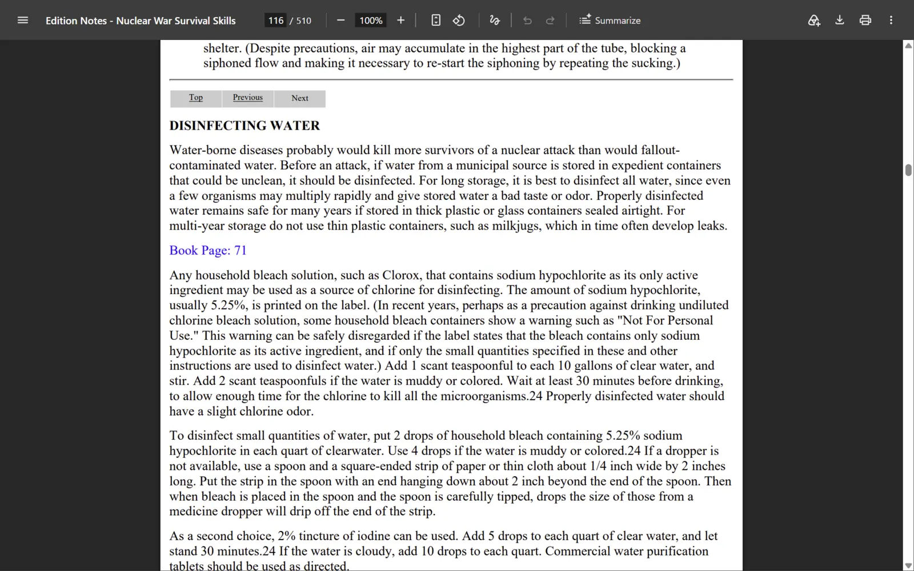
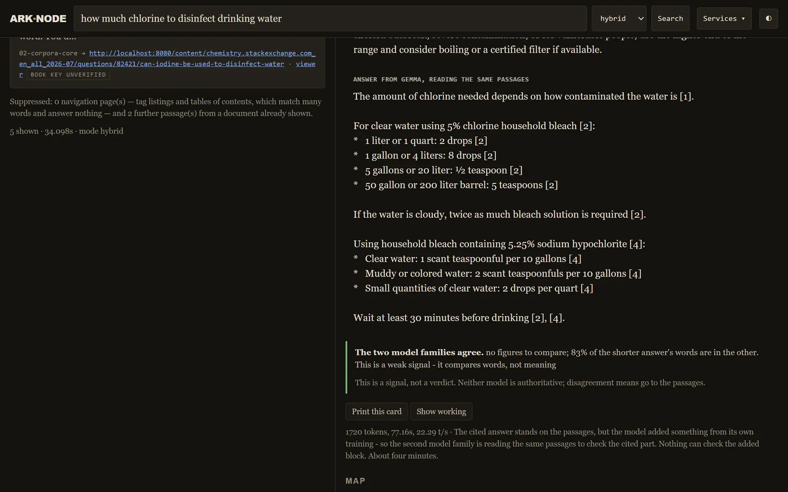
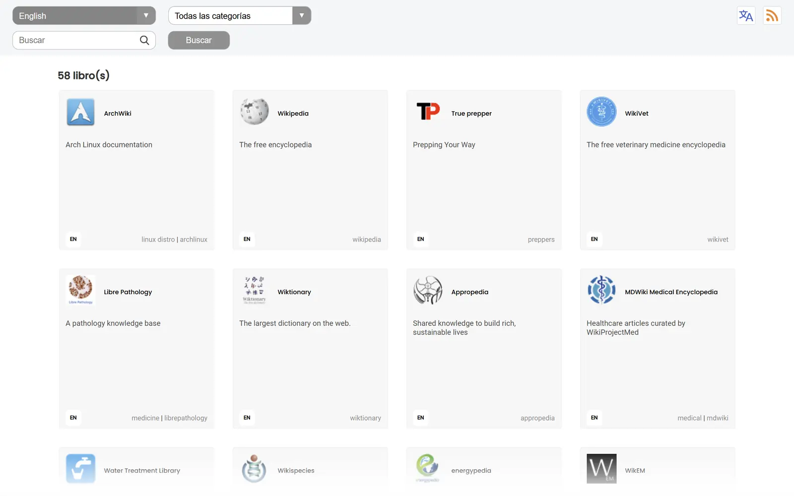

# Nodo del Arca del Conocimiento

**IA fuera de la red que lleva conocimiento verificable a los lugares que más lo
necesitan.** Donde la electricidad falla y el internet no está garantizado, el
Arca del Conocimiento pone una IA de pesos abiertos junto a una biblioteca del
conocimiento práctico de la humanidad (medicina, agua potable, ingeniería,
agricultura, reparación) en una sola computadora que no necesita conexión para
funcionar. Cada respuesta se basa en esa biblioteca y cita la página de donde
salió, para que quien pregunta pueda leer la fuente antes de actuar. El
conocimiento no debería depender de un cable ni de una suscripción.

Este repositorio es el software que la hace funcionar: el motor de respuestas,
las herramientas que descargan y verifican la biblioteca, y un kit inicial que
convierte un PC con Windows y una tarjeta NVIDIA en un nodo funcionando en cerca
de una hora. Sin cuenta y sin nube: una vez instalado, nada sale de la máquina.
La visión, el diseño del equipo alimentado por sol y el catálogo completo están
en **[arkofnoahledge.org](https://arkofnoahledge.org/es/)**.

[Read in English](README.md)



## Qué lo hace distinto

1. **Cada respuesta cita una página que puedes abrir sin conexión.** Los pasajes
   aparecen junto a la respuesta, y cada cita abre el original en
   [Kiwix](https://kiwix.org), en la misma máquina.
2. **Lo que el modelo sabe por su cuenta va marcado.** Cuando el modelo añade algo
   que ningún pasaje respalda, ese bloque lo dice, y nunca se presenta como si
   viniera de la biblioteca.
3. **Una segunda familia de modelos puede revisar la parte citada.** Un modelo de
   otro desarrollador lee los mismos pasajes y el nodo compara las dos respuestas.
   Esto requiere el modelo de verificación, que el kit inicial no descarga (ver
   abajo).
4. **Un detector de seguridad señala dosis, químicos y voltajes** y te pide leer
   la fuente antes de actuar.
5. **Bilingüe**, inglés y español, en la interfaz y en la biblioteca.
6. **Crece y se achica.** El kit inicial ocupa 20 GB. Las mismas herramientas
   construyen el archivo de referencia: 2,4 TB y 39 millones de pasajes indexados,
   servidos desde un portátil.
7. **Hecho para durar.** Sumas de verificación para cada archivo, un catálogo
   fijado a versiones exactas, y pasos de recuperación escritos para seguirse
   desde papel.



## Inicio rápido: el kit inicial

**Necesitas:**

1. Windows 10 u 11, de 64 bits.
2. Una tarjeta NVIDIA con 6 GB de memoria o más, y un controlador NVIDIA de
   2023 o posterior. 16 GB es el tamaño probado de principio a fin.
3. 16 GB de RAM.
4. Unos 35 GB libres en disco.
5. Python 3.12, instalado como se indica abajo.
6. Conexión a internet solo para la instalación: unos 23 GB de descargas con
   una tarjeta de 16 GB, unos 10 GB con una de 6 u 8 GB.

**Primero instala Python** (sáltalo si `python --version` ya muestra
`Python 3.12`):

1. Ve a [python.org/downloads/windows](https://www.python.org/downloads/windows/),
   busca la versión más reciente de **Python 3.12** y, debajo, haz clic en
   **Download Windows installer (64-bit)**. No uses el botón grande de la página
   principal de descargas: instala un Python más nuevo que el que se probó.
2. Ejecútalo. En la primera pantalla marca **Add python.exe to PATH**, abajo, y
   haz clic en **Install Now**.
3. **Cierra PowerShell y abre uno nuevo**, para que vea el Python nuevo.
4. Comprueba: `python --version` debe mostrar `Python 3.12.x`. Si en cambio
   muestra un mensaje sobre la Microsoft Store, abre *Configuración*,
   *Aplicaciones*, *Configuración avanzada de aplicaciones*, *Alias de ejecución
   de aplicaciones*, desactiva las dos entradas *Instalador de aplicación* de
   `python.exe` y `python3.exe`, y abre un PowerShell nuevo.

**Después:**

1. Descarga este repositorio (*Code*, luego *Download ZIP*) y extráelo en una
   carpeta corta y sin espacios, por ejemplo `C:\ark`. O clónalo ahí con git.
2. Abre PowerShell en esa carpeta (en el Explorador de archivos, abre la
   carpeta, clic derecho en un espacio vacío, *Abrir en Terminal*) y ejecuta:

   ```
   python bin\ark.py setup --profile starter --plan
   python bin\ark.py setup --profile starter
   ```

   El primer comando muestra lo que va a pasar y no cambia nada. El segundo lo
   hace: elige el modelo para tu tarjeta, descarga y verifica cada archivo,
   instala el entorno de Python, construye el índice de búsqueda en tu GPU,
   arranca los servidores y hace una primera pregunta en inglés y en español.
3. Cuando termine, abre **http://localhost:8090** y pregunta.

En la máquina de referencia (RTX 4090 Laptop, 16 GB) la instalación completa tomó
**70 minutos**: unos 30 para descargar a 85 Mbit/s y unos 30 para construir el
índice. Si algo la detiene, ejecuta el mismo comando otra vez: los pasos ya
terminados se saltan. Si se detiene con un mensaje, ver
[Solución de problemas](#solución-de-problemas).

**Cada día, después:**

```
python bin\ark.py up        arranca los servidores
python bin\ark.py status    qué está corriendo, y por qué algo no
python bin\ark.py down      los detiene
```

`bin\ark.cmd` hace lo mismo con doble clic.

## Qué trae el kit inicial

| | |
|---|---|
| Guías de tratamiento de agua, medicina y emergencias | tres colecciones [zimgit](https://download.kiwix.org/zim/other/) de manuales de campo, en inglés |
| Medicina | los artículos de medicina de Wikipedia, en español |
| El modelo que responde | elegido para tu tarjeta: Qwen3.8-27B con 16 GB, Gemma 4 12B con 12 GB, Phi-4-mini con 8 GB |
| El modelo de búsqueda | BGE-M3, multilingüe |
| Los programas | llama.cpp y kiwix-tools, versiones para Windows |

Todo está listado, con su fuente, suma de verificación y licencia, en
[`13-ark-node/catalog/catalog.csv`](13-ark-node/catalog/catalog.csv) (ver su
[README](13-ark-node/catalog/README.md)).

**El modelo de verificación no viene en el kit inicial.** Para añadirlo en una
tarjeta de 16 GB con 32 GB de RAM o más:

```
python bin\ark.py fetch google_gemma-4-31b-it-iq4_xs
```

luego pon `enabled = true` bajo `[models.crosscheck]` en `ark.toml` y ejecuta
`python bin\ark.py up`.

## Para ir más lejos

```
python bin\ark.py config --profiles                 los pares de modelos para tarjetas de 8, 12, 16 y 24 GB
python bin\ark.py fetch --list --profile full       cada fila del catálogo completo, unos 2,1 TB
python bin\ark.py fetch ID                          descarga cualquier fila, verificada por sha256
python bin\ark.py verify                            compara cada archivo con sus sumas
python bin\ark.py selftest                          las pruebas de las herramientas; no necesita GPU
python bin\ci.py                                    todo lo que corre la CI; no necesita el archivo
```

Más contenido se indexa con `bin\index-build.py` y un archivo de alcance, y se
vuelve buscable con `python bin\ark.py index`.
[`13-ark-node/README.md`](13-ark-node/README.md) describe cómo funciona el nodo y
por qué, y [`13-ark-node/RECOVERY.md`](13-ark-node/RECOVERY.md) es el procedimiento
de recuperación (ambos en inglés).



*Las capturas son del archivo de referencia, que contiene más que el kit
inicial.*

## Solución de problemas

La instalación revisa cada paso y se detiene en el primero que no funcionó,
diciendo por qué. Corrige eso y ejecuta el mismo comando otra vez. Los mensajes
salen en inglés:

| Ves | Qué hacer |
|---|---|
| *Python was not found; run without arguments to install from the Microsoft Store* | Python no está instalado, o esta ventana de PowerShell se abrió antes de instalarlo. Ver *Primero instala Python*. |
| *no NVIDIA card found* | Instala o actualiza el controlador desde [nvidia.com/drivers](https://www.nvidia.com/drivers) y comprueba que `nvidia-smi` muestra tu tarjeta. |
| *this NVIDIA card has N MiB, and the smallest profile ... needs about ...* | La tarjeta es demasiado pequeña para cualquier perfil de modelos. `--models 8gb` lo intenta de todos modos. |
| *the server's certificate could not be verified* | Tu red inspecciona el tráfico cifrado (algunas empresas, escuelas y antivirus lo hacen). Pide el archivo de su certificado a quien administra la red y en PowerShell: `$env:SSL_CERT_FILE = "C:\ruta\al\certificado.pem"`; luego ejecuta la instalación otra vez en la misma ventana. |
| *will not import: torch ... DLL load failed* | Instala el [Microsoft Visual C++ Redistributable (x64)](https://aka.ms/vs/17/release/vc_redist.x64.exe) y ejecuta la instalación otra vez. |
| *torch ... does not see an NVIDIA GPU* | Actualiza el controlador NVIDIA y ejecuta la instalación otra vez. |
| Windows pregunta si permitir Python o kiwix-serve en redes | *Permitir* en redes privadas deja que un teléfono u otra computadora de tu red use el nodo. *Cancelar* lo deja solo en este equipo. Ambas opciones funcionan. |

## Lee esto antes de confiar en él

**Esto no es consejo médico, legal ni de ingeniería, y no es un profesional.** Es
una herramienta de búsqueda sobre documentos escritos por otros, con un modelo de
lenguaje que puede equivocarse. Lee el pasaje citado antes de actuar sobre
cualquier dosis, mezcla, voltaje o procedimiento, que es lo que te pide el aviso
ámbar de la interfaz. Cuando importa, consulta a una persona calificada.

**Límites conocidos de esta versión:**

1. Probado en una sola máquina: una RTX 4090 Laptop (16 GB) con 64 GB de RAM. Los
   pares de modelos para 8, 12 y 24 GB caben en sus tarjetas, pero no han pasado
   las preguntas de aceptación del nodo.
2. El kit inicial funciona sin el modelo de verificación, así que lo que el modelo
   añade por su cuenta va marcado pero no se revisa.
3. De vez en cuando el modelo que responde devuelve su propio razonamiento en vez
   de una respuesta, con la marca de citas normal. Si una respuesta se lee como
   alguien pensando en voz alta, pregunta otra vez y lee los pasajes.
4. Solo Windows y NVIDIA. El código corre en Linux, pero `setup` descarga
   versiones para Windows.
5. Una construcción de referencia mantenida por una persona, en la medida de lo
   posible.

## Licencias

1. **Código:** Apache License 2.0, ver [LICENSE](LICENSE).
2. **Documentación:** Creative Commons Atribución 4.0, ver
   [LICENSE-docs](LICENSE-docs).
3. **El contenido que descargas** conserva su propia licencia, listada por fila en
   el catálogo junto con si se puede redistribuir. Parte no se puede: lee esa
   columna antes de armar un nodo para otra persona.
4. **Los programas que descarga setup** conservan las suyas: ver [NOTICE](NOTICE).
5. El nombre *Ark of Noahledge* no queda licenciado por ninguna de las dos.

## El proyecto

El nodo es la mitad que funciona de [Ark of Noahledge](https://arkofnoahledge.org/es/),
un diseño de máquina de conocimiento sin conexión y de bajo consumo, que sigue
siendo útil sin internet y sin red eléctrica. El diseño, el catálogo completo y
estas herramientas son gratuitos. Un libro que guía la construcción paso a paso
es el camino guiado y de pago.

Creado por Juan Hurtado, fundador de Ark of Noahledge
([LinkedIn](https://www.linkedin.com/in/juaneshurtado)), con los colaboradores de Ark of Noahledge.

Las contribuciones son bienvenidas: ver [CONTRIBUTING.md](CONTRIBUTING.md).
Problemas de seguridad: ver [SECURITY.md](SECURITY.md).
